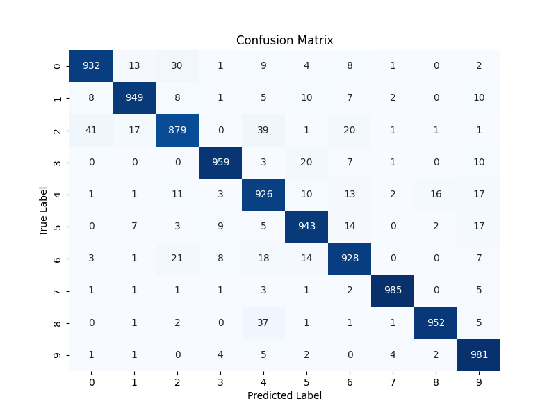

# classification-base-bert

## 目录

- [项目介绍](#项目介绍)
- [环境安装](#环境安装)
- [使用方法](#使用方法)
- [贡献指南](#贡献指南)
- [许可证](#许可证)
- [注意](#注意)

## 项目介绍

本项目使用`google-bert/bert-base-chinese`模型进行中文文本分类任务，使用中文数据集进行训练，训练完成后，可以导出模型，进行预测。

## 环境安装

1. 创建新的虚拟环境   \
`conda create -n bert_env python=3.8`
2. 激活环境  \
`conda activate bert_env`
3. 安装依赖包，临时使用镜像源  \
 `pip install -r requirements.txt -i https://pypi.tuna.tsinghua.edu.cn/simple`

## 使用方法

环境搭建完成，激活依赖下载完成后可以按需求分别执行`predict_single.py`和`predict_batch.py`文件。

在THUCNews/data/test.csv数据集上进行测试的结果如下：

混淆矩阵的详细参考[这里](https://blog.csdn.net/weixin_42924890/article/details/135561264)

分类指标如下：

| 指标       | 值     |
|------------|--------|
| Accuracy      | 0.9434   |
| Precision     | 0.9438   |
| Recall        | 0.9434   |

## 贡献指南

## 许可证

项目采用Apache License 2.0许可。

## 注意

1. `bert-base-chinese` 需要自行下载，下载方式参考`classification-base-bert/bert-base-chinese/README.md`
2. `classification-base-bert/model_config.py`的`model_path`是预训练后的模型文件，推理之前需要先执行`model_train.py`文件进行训练。
